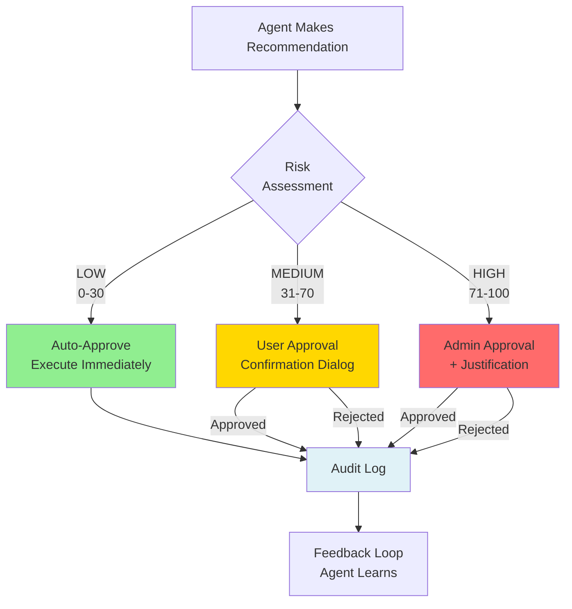
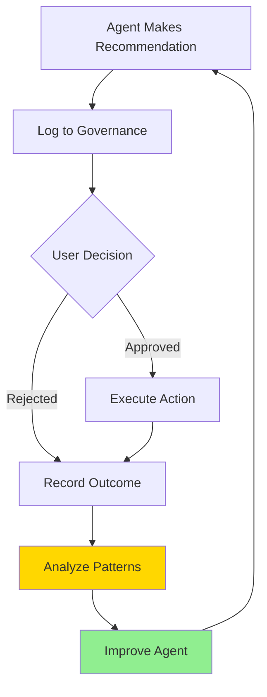

# AI Agent Team Management Framework

**Governance Patterns for Multi-Agent Systems**

---

## Executive Summary

This framework provides battle-tested patterns for managing teams of AI agents working on complex, high-stakes tasks. It addresses the unique challenges of autonomous agents making recommendations that could have significant impact (financial, operational, security, etc.).

**Key Principles**:
- **Human-in-the-Loop (HITL)**: Risk-based approval workflows
- **Audit Everything**: Complete trail of recommendations vs decisions
- **Tiered Governance**: Different risk levels require different approval gates
- **Code-Based Rules**: Git-versioned constraints, not database complexity
- **Performance**: Memory-cached access, not HTTP overhead

---

## The Challenge

AI agents can be incredibly powerful, but they need guardrails:

**Without Governance**:
- ❌ Agents make risky recommendations without oversight
- ❌ No audit trail of what agents suggested vs what users did
- ❌ Inconsistent behavior across agents
- ❌ Hard to debug failures or learn from mistakes
- ❌ Users don't understand why agents recommended X

**With Governance**:
- ✅ Risk-based approval gates (auto-approve LOW, user approval MEDIUM, admin approval HIGH)
- ✅ Complete audit trail (who, what, when, why)
- ✅ Consistent behavior (all agents follow same rules)
- ✅ Continuous improvement (learn from human decisions)
- ✅ Explainable AI (show reasoning and research)

---

## Three-Tier Governance Model



---

## Risk Classification Framework

### Composite Risk Score

Risk is calculated from multiple factors:

```python
risk_score = (
    trading_mode_weight * 40 +           # Live=100, Test=50, Inactive=0
    parameter_extremity_weight * 30 +    # Conservative=0, Aggressive=100
    scope_weight * 20 +                  # Single=0, Bulk=100
    reversibility_weight * 10            # Reversible=0, Irreversible=100
)

# Classification:
# 0-30: LOW RISK (auto-approve)
# 31-70: MEDIUM RISK (user approval)
# 71-100: HIGH RISK (admin approval)
```

### Risk Factors

**1. Mode/Environment** (40% weight)
- Production/Live: 100 points
- Staging/Test: 50 points
- Development/Inactive: 0 points

**2. Parameter Extremity** (30% weight)
- Conservative tier: 0 points
- Moderate tier: 50 points
- Aggressive tier: 75 points
- Very aggressive tier: 100 points

**3. Scope** (20% weight)
- Single entity: 0 points
- Multiple entities: 50 points
- Bulk operations: 100 points

**4. Reversibility** (10% weight)
- Easily reversible: 0 points
- Effort required: 50 points
- Irreversible: 100 points

### Special High-Risk Triggers

Some actions automatically trigger HIGH risk regardless of score:
- Switching from test → production/live mode
- Disabling safety controls (stop loss, circuit breakers)
- Parameter values >2 standard deviations from mean
- Bulk operations in production
- Actions affecting real money/production data

---

## Database Schema for Audit Trail

### agent_governance_log Table

```sql
CREATE TABLE agent_governance_log (
    id INTEGER PRIMARY KEY AUTOINCREMENT,
    
    -- Agent Information
    agent_name TEXT NOT NULL,
    session_id TEXT NOT NULL,
    action_type TEXT NOT NULL,  -- 'create_strategy', 'modify_parameters', 'optimize', etc.
    action_details JSON NOT NULL,
    
    -- Recommendations
    recommended_changes JSON,
    rationale TEXT,
    research_citations JSON,
    
    -- Risk Assessment
    risk_score INTEGER NOT NULL,
    risk_level TEXT NOT NULL,  -- 'LOW', 'MEDIUM', 'HIGH'
    risk_factors JSON,
    
    -- Approval Workflow
    requires_approval BOOLEAN NOT NULL DEFAULT 0,
    approval_status TEXT,  -- 'pending', 'approved', 'rejected', 'auto_approved'
    approved_by TEXT,
    approval_timestamp DATETIME,
    rejection_reason TEXT,
    
    -- Execution
    executed BOOLEAN DEFAULT 0,
    execution_timestamp DATETIME,
    execution_result TEXT,
    
    -- Outcomes
    outcome_success BOOLEAN,
    outcome_details JSON,
    outcome_timestamp DATETIME,
    
    -- Feedback Loop
    user_feedback TEXT,
    feedback_timestamp DATETIME,
    
    -- Metadata
    created_at DATETIME NOT NULL,
    updated_at DATETIME NOT NULL,
    
    -- Indexes
    INDEX idx_agent_name (agent_name),
    INDEX idx_session_id (session_id),
    INDEX idx_risk_level (risk_level),
    INDEX idx_approval_status (approval_status),
    INDEX idx_created_at (created_at)
);
```

---

## Implementation Pattern

### 1. Agent Makes Recommendation

```python
class StrategyOptimizerAgent:
    """Agent that optimizes strategy configurations."""
    
    async def optimize_strategy(self, strategy_id: int, session_id: str):
        """Generate optimization recommendations."""
        
        # Step 1: Analyze current configuration
        strategy = self.load_strategy(strategy_id)
        analysis = self.analyze_strategy(strategy)
        
        # Step 2: Generate recommendations
        recommendations = self.generate_recommendations(analysis)
        
        # Step 3: Calculate risk score
        risk_assessment = self.calculate_risk(
            strategy=strategy,
            recommendations=recommendations
        )
        
        # Step 4: Log to governance system
        log_entry = await self.governance.log_recommendation(
            agent_name="strategy_optimizer",
            session_id=session_id,
            action_type="modify_strategy",
            action_details={
                "strategy_id": strategy_id,
                "current_config": strategy.config,
                "proposed_changes": recommendations
            },
            recommended_changes=recommendations,
            rationale=analysis['rationale'],
            research_citations=analysis['research'],
            risk_score=risk_assessment['score'],
            risk_level=risk_assessment['level'],
            risk_factors=risk_assessment['factors']
        )
        
        # Step 5: Return recommendation to user
        return {
            "recommendations": recommendations,
            "risk_level": risk_assessment['level'],
            "requires_approval": risk_assessment['level'] in ['MEDIUM', 'HIGH'],
            "governance_log_id": log_entry.id
        }
```

### 2. Risk Calculation Service

```python
class RiskAssessmentService:
    """Calculate risk scores for agent recommendations."""
    
    def calculate_risk(
        self,
        strategy: Strategy,
        recommendations: Dict
    ) -> Dict:
        """
        Calculate composite risk score.
        
        Returns:
            {
                "score": 0-100,
                "level": "LOW" | "MEDIUM" | "HIGH",
                "factors": {...}
            }
        """
        
        # Factor 1: Mode/Environment (40%)
        mode_score = self._calculate_mode_score(strategy)
        
        # Factor 2: Parameter Extremity (30%)
        param_score = self._calculate_parameter_score(recommendations)
        
        # Factor 3: Scope (20%)
        scope_score = self._calculate_scope_score(strategy, recommendations)
        
        # Factor 4: Reversibility (10%)
        reversibility_score = self._calculate_reversibility_score(recommendations)
        
        # Composite score
        total_score = (
            mode_score * 0.4 +
            param_score * 0.3 +
            scope_score * 0.2 +
            reversibility_score * 0.1
        )
        
        # Check for auto-HIGH triggers
        if self._check_high_risk_triggers(strategy, recommendations):
            total_score = max(total_score, 75)  # Force HIGH
        
        # Classify
        if total_score <= 30:
            level = "LOW"
        elif total_score <= 70:
            level = "MEDIUM"
        else:
            level = "HIGH"
        
        return {
            "score": round(total_score, 2),
            "level": level,
            "factors": {
                "mode": mode_score,
                "parameters": param_score,
                "scope": scope_score,
                "reversibility": reversibility_score
            }
        }
    
    def _calculate_mode_score(self, strategy: Strategy) -> float:
        """Calculate mode/environment risk (0-100)."""
        if strategy.trading_mode == 'live':
            return 100.0
        elif strategy.trading_mode == 'paper':
            return 50.0
        else:
            return 0.0
    
    def _calculate_parameter_score(self, recommendations: Dict) -> float:
        """Calculate parameter extremity risk (0-100)."""
        scores = []
        
        for param, value in recommendations.items():
            guidance = self.rules.get_guidance(param)
            
            # Determine which tier this value falls into
            if self._in_range(value, guidance['conservative']['range']):
                scores.append(0)
            elif self._in_range(value, guidance['moderate']['range']):
                scores.append(50)
            elif self._in_range(value, guidance['aggressive']['range']):
                scores.append(75)
            else:
                scores.append(100)  # Very aggressive or outside guidance
        
        return sum(scores) / len(scores) if scores else 0
    
    def _check_high_risk_triggers(
        self,
        strategy: Strategy,
        recommendations: Dict
    ) -> bool:
        """Check for automatic HIGH risk triggers."""
        
        # Trigger 1: Switching to live mode
        if recommendations.get('trading_mode') == 'live':
            return True
        
        # Trigger 2: Disabling safety controls
        if recommendations.get('stop_loss_enabled') is False:
            return True
        
        # Trigger 3: Extreme parameter values
        for param, value in recommendations.items():
            validation = self.rules.get_validation_rules(param)
            if value > validation.get('extreme_threshold', float('inf')):
                return True
        
        return False
```

### 3. Approval Workflow

```python
class ApprovalWorkflowService:
    """Handle approval gates for agent recommendations."""
    
    async def process_approval_request(
        self,
        log_id: int,
        user_id: str,
        action: str,  # 'approve' or 'reject'
        reason: str = None
    ):
        """Process user/admin approval or rejection."""
        
        # Load governance log entry
        log_entry = await self.db.get_governance_log(log_id)
        
        # Verify user has permission
        if log_entry.risk_level == 'HIGH':
            # Require admin role
            if not self.is_admin(user_id):
                raise PermissionError("Admin approval required for HIGH risk actions")
        
        # Update approval status
        if action == 'approve':
            log_entry.approval_status = 'approved'
            log_entry.approved_by = user_id
            log_entry.approval_timestamp = datetime.utcnow()
            
            # Execute the recommended action
            await self.execute_action(log_entry)
            
        elif action == 'reject':
            log_entry.approval_status = 'rejected'
            log_entry.approved_by = user_id
            log_entry.approval_timestamp = datetime.utcnow()
            log_entry.rejection_reason = reason
        
        await self.db.update_governance_log(log_entry)
        
        return log_entry
    
    async def execute_action(self, log_entry: GovernanceLog):
        """Execute approved action and record outcome."""
        
        try:
            # Execute the action
            if log_entry.action_type == 'modify_strategy':
                result = await self.strategy_service.update_strategy(
                    strategy_id=log_entry.action_details['strategy_id'],
                    changes=log_entry.recommended_changes
                )
                success = True
                details = {"strategy_id": result.id}
            
            # Record outcome
            await self.record_outcome(
                log_id=log_entry.id,
                success=success,
                details=details
            )
            
        except Exception as e:
            # Record failure
            await self.record_outcome(
                log_id=log_entry.id,
                success=False,
                details={"error": str(e)}
            )
            raise
```

### 4. Governance Helper (Agent Integration)

```python
class GovernanceHelper:
    """Simplified governance integration for agents."""
    
    def __init__(self, db: Session):
        self.db = db
        self.risk_service = RiskAssessmentService()
        self.approval_service = ApprovalWorkflowService()
    
    async def log_recommendation(
        self,
        agent_name: str,
        session_id: str,
        action_type: str,
        action_details: Dict,
        strategy: Strategy = None,
        parameters: Dict = None,
        auto_approve: bool = False
    ) -> int:
        """
        Log agent recommendation with risk assessment.
        
        Args:
            auto_approve: If True, auto-approve all recommendations
                         (useful for single-user scenarios)
        
        Returns:
            governance_log_id
        """
        
        # Calculate risk
        risk = self.risk_service.calculate_risk(
            strategy=strategy,
            recommendations=parameters or {}
        )
        
        # Determine if approval needed
        requires_approval = (
            risk['level'] in ['MEDIUM', 'HIGH'] and
            not auto_approve
        )
        
        # Create log entry
        log_entry = GovernanceLog(
            agent_name=agent_name,
            session_id=session_id,
            action_type=action_type,
            action_details=action_details,
            recommended_changes=parameters,
            risk_score=risk['score'],
            risk_level=risk['level'],
            risk_factors=risk['factors'],
            requires_approval=requires_approval,
            approval_status='auto_approved' if auto_approve else 'pending',
            created_at=datetime.utcnow(),
            updated_at=datetime.utcnow()
        )
        
        self.db.add(log_entry)
        self.db.commit()
        
        return log_entry.id
    
    async def record_outcome(
        self,
        log_id: int,
        success: bool,
        details: Dict
    ):
        """Record execution outcome."""
        
        log_entry = self.db.query(GovernanceLog).get(log_id)
        log_entry.executed = True
        log_entry.execution_timestamp = datetime.utcnow()
        log_entry.outcome_success = success
        log_entry.outcome_details = details
        log_entry.outcome_timestamp = datetime.utcnow()
        log_entry.updated_at = datetime.utcnow()
        
        self.db.commit()
```

---

## Deployment Modes

### Mode 1: Single-User Auto-Approve

**Use Case**: Solo developer, low-stakes testing, prototyping

**Configuration**:
```python
governance = GovernanceHelper(db)
log_id = await governance.log_recommendation(
    agent_name="optimizer",
    session_id=session_id,
    action_type="optimize",
    action_details={...},
    auto_approve=True  # ← Auto-approve everything
)
```

**Benefits**:
- ✅ Zero friction (no approval gates)
- ✅ Complete audit trail (every recommendation logged)
- ✅ Risk awareness (scores calculated and displayed)
- ✅ Easy upgrade path (flip auto_approve to False)

---

### Mode 2: User Approval (Single-Tier)

**Use Case**: Small team, moderate-stakes operations

**Configuration**:
```python
log_id = await governance.log_recommendation(
    ...,
    auto_approve=False  # ← User approval required for MEDIUM/HIGH
)

# User sees approval dialog
if risk_level == 'LOW':
    # Execute immediately
    await execute_action(log_id)
else:
    # Show approval dialog
    user_choice = await show_approval_dialog(recommendations, risk_level)
    if user_choice == 'approve':
        await approval_service.process_approval_request(log_id, user_id, 'approve')
```

**Benefits**:
- ✅ User control over risky actions
- ✅ Auto-approve LOW risk (efficiency)
- ✅ Audit trail with approval timestamps
- ✅ Learn from user decisions

---

### Mode 3: Two-Tier Approval (User + Admin)

**Use Case**: Large organization, high-stakes operations, compliance requirements

**Configuration**:
```python
if risk_level == 'LOW':
    # Execute immediately
    await execute_action(log_id)
elif risk_level == 'MEDIUM':
    # User approval required
    await show_approval_dialog(user_role='user')
elif risk_level == 'HIGH':
    # Admin approval required
    await show_approval_dialog(user_role='admin', require_justification=True)
```

**Benefits**:
- ✅ Multi-level oversight
- ✅ Admin gate for critical actions
- ✅ Justification required for HIGH risk
- ✅ Compliance-ready audit trail

---

## Governance Dashboard

### Key Metrics

**Approval Metrics**:
- Overall approval rate (approved / total recommendations)
- Approval rate by risk level (LOW/MEDIUM/HIGH)
- Approval rate by agent (which agents make good recommendations?)

**Agent Performance**:
- Recommendations per agent
- Approval rate per agent (quality metric)
- Success rate per agent (execution quality)

**Risk Distribution**:
- Count and percentage of LOW/MEDIUM/HIGH recommendations
- Risk score histogram
- Trends over time

**Outcomes**:
- Success vs failed executions
- Success rate by risk level
- Success rate by agent

### Dashboard UI Components

```html
<!-- Metrics Cards -->
<div class="stats">
    <div class="stat">
        <div class="stat-title">Total Recommendations</div>
        <div class="stat-value">247</div>
    </div>
    <div class="stat">
        <div class="stat-title">Approval Rate</div>
        <div class="stat-value">94%</div>
    </div>
    <div class="stat">
        <div class="stat-title">Success Rate</div>
        <div class="stat-value">98%</div>
    </div>
</div>

<!-- Risk Distribution -->
<div class="chart">
    <h3>Risk Distribution</h3>
    <div class="progress-bars">
        <div class="progress" data-risk="LOW">
            <span>LOW (65%)</span>
            <progress value="65" max="100"></progress>
        </div>
        <div class="progress" data-risk="MEDIUM">
            <span>MEDIUM (30%)</span>
            <progress value="30" max="100"></progress>
        </div>
        <div class="progress" data-risk="HIGH">
            <span>HIGH (5%)</span>
            <progress value="5" max="100"></progress>
        </div>
    </div>
</div>

<!-- Agent Performance -->
<table class="agent-metrics">
    <thead>
        <tr>
            <th>Agent</th>
            <th>Recommendations</th>
            <th>Approval Rate</th>
            <th>Success Rate</th>
        </tr>
    </thead>
    <tbody>
        <tr>
            <td>Strategy Optimizer</td>
            <td>45</td>
            <td>96%</td>
            <td>100%</td>
        </tr>
        <tr>
            <td>Risk Manager</td>
            <td>82</td>
            <td>98%</td>
            <td>99%</td>
        </tr>
    </tbody>
</table>

<!-- Pending Approvals -->
<div class="pending-approvals">
    <h3>Pending Approvals (3)</h3>
    <div class="approval-card" data-risk="MEDIUM">
        <div class="card-header">
            <span class="badge badge-warning">MEDIUM RISK</span>
            <span class="agent">Strategy Optimizer</span>
        </div>
        <div class="card-body">
            <p>Modify RSI Strategy: Increase stop loss from 3% → 5%</p>
            <div class="risk-score">Risk Score: 45</div>
        </div>
        <div class="card-actions">
            <button class="btn btn-success">Approve</button>
            <button class="btn btn-error">Reject</button>
        </div>
    </div>
</div>
```

---

## Feedback Loop & Agent Learning

### Recording User Feedback

```python
async def record_user_feedback(
    log_id: int,
    feedback: str
):
    """Record user feedback on agent recommendation."""
    
    log_entry = await db.get_governance_log(log_id)
    log_entry.user_feedback = feedback
    log_entry.feedback_timestamp = datetime.utcnow()
    await db.update_governance_log(log_entry)
```

### Learning Patterns

**Pattern 1: Rejection Analysis**
```sql
-- Find most commonly rejected recommendations
SELECT 
    agent_name,
    action_type,
    COUNT(*) as rejection_count,
    rejection_reason
FROM agent_governance_log
WHERE approval_status = 'rejected'
GROUP BY agent_name, action_type, rejection_reason
ORDER BY rejection_count DESC
LIMIT 10;
```

**Pattern 2: Successful Outcomes**
```sql
-- Find recommendations that led to successful outcomes
SELECT 
    agent_name,
    recommended_changes,
    risk_level,
    outcome_details
FROM agent_governance_log
WHERE outcome_success = TRUE
AND risk_level = 'HIGH'  -- HIGH risk but successful
ORDER BY created_at DESC;
```

**Pattern 3: Risk Score Calibration**
```sql
-- Compare risk scores vs actual outcomes
SELECT 
    risk_level,
    AVG(risk_score) as avg_risk_score,
    COUNT(*) as total,
    SUM(CASE WHEN outcome_success THEN 1 ELSE 0 END) as successful,
    AVG(CASE WHEN outcome_success THEN 1.0 ELSE 0.0 END) as success_rate
FROM agent_governance_log
WHERE executed = TRUE
GROUP BY risk_level;
```

### Agent Improvement Cycle



---

## Best Practices

### 1. Start Small, Scale Up

**Phase 1**: Implement basic audit logging (no approval gates)
```python
# Just log everything
governance.log_recommendation(..., auto_approve=True)
```

**Phase 2**: Add risk scoring and visualization
```python
# Calculate risk but don't block
risk = calculate_risk(...)
display_risk_score(risk)
```

**Phase 3**: Implement approval gates for HIGH risk
```python
# Block HIGH risk only
if risk_level == 'HIGH':
    require_approval()
```

**Phase 4**: Expand to MEDIUM risk
```python
# Block MEDIUM and HIGH
if risk_level in ['MEDIUM', 'HIGH']:
    require_approval()
```

### 2. Make Risk Transparent

**Always Show**:
- ✅ Risk score and level
- ✅ Contributing factors
- ✅ What makes this risky
- ✅ What would make it less risky

**Example Dialog**:
```
🔴 HIGH RISK (Score: 85)

This action is high risk because:
• Switching from paper → live trading mode (+40)
• Stop loss 8% is aggressive (+30)
• Affects active strategy (+10)
• Difficult to reverse (+5)

To reduce risk:
• Test in paper mode first
• Use moderate stop loss (3-5%)
• Create inactive copy for testing
```

### 3. Collect Feedback Proactively

**After Approval**:
```
Action approved! How confident are you in this decision?
[ Very Confident ] [ Confident ] [ Uncertain ]

Optional: Add notes for future reference
[                                        ]
```

**After Rejection**:
```
Action rejected. What was the main concern?
[ ] Too risky
[ ] Unclear benefit
[ ] Timing not right
[ ] Need more information
[ ] Other: ___________
```

### 4. Review Patterns Regularly

**Weekly Review**:
- Which agents get approved most often?
- Which risk factors trigger most rejections?
- Are risk scores calibrated correctly?
- Any patterns in user feedback?

**Monthly Review**:
- Agent performance trends
- Risk score accuracy (predicted vs actual)
- Approval workflow efficiency
- Opportunities for automation

### 5. Automate Where Safe

**Good Candidates for Auto-Approval**:
- ✅ Read-only operations (analysis, queries)
- ✅ Recommendations without auto-apply
- ✅ Creating inactive/test entities
- ✅ Documentation queries

**Bad Candidates for Auto-Approval**:
- ❌ Production/live mode actions
- ❌ Disabling safety controls
- ❌ Bulk operations
- ❌ Irreversible changes

---

## Testing Strategy

### Unit Tests

```python
def test_risk_calculation_low():
    """Test LOW risk scoring."""
    service = RiskAssessmentService()
    
    risk = service.calculate_risk(
        strategy=mock_strategy(trading_mode='inactive'),
        recommendations={'stop_loss_pct': 1.5}  # Conservative
    )
    
    assert risk['level'] == 'LOW'
    assert risk['score'] <= 30

def test_risk_calculation_high():
    """Test HIGH risk scoring."""
    service = RiskAssessmentService()
    
    risk = service.calculate_risk(
        strategy=mock_strategy(trading_mode='live'),
        recommendations={'stop_loss_pct': 15.0}  # Very aggressive
    )
    
    assert risk['level'] == 'HIGH'
    assert risk['score'] >= 71
```

### Integration Tests

```python
async def test_approval_workflow():
    """Test complete approval workflow."""
    
    # Step 1: Agent makes recommendation
    log_id = await governance.log_recommendation(
        agent_name="optimizer",
        action_type="modify_strategy",
        action_details={...},
        parameters={'stop_loss_pct': 5.0}
    )
    
    # Step 2: Check approval required
    log = await db.get_governance_log(log_id)
    assert log.requires_approval == True
    assert log.approval_status == 'pending'
    
    # Step 3: User approves
    await approval_service.process_approval_request(
        log_id=log_id,
        user_id='user123',
        action='approve'
    )
    
    # Step 4: Verify execution
    log = await db.get_governance_log(log_id)
    assert log.approval_status == 'approved'
    assert log.executed == True
    assert log.outcome_success == True
```

---

## Migration Path

### From No Governance

**Week 1**: Implement audit logging only
```python
# Add logging but don't block anything
governance.log_recommendation(..., auto_approve=True)
```

**Week 2**: Add risk scoring
```python
# Calculate and display risk, but still auto-approve
risk = calculate_risk(...)
log_recommendation(..., risk_score=risk['score'])
```

**Week 3**: Add dashboard
```python
# Visualize risk distribution and agent performance
dashboard = GovernanceDashboard(db)
dashboard.render()
```

**Week 4**: Implement approval gates
```python
# Start blocking HIGH risk only
if risk_level == 'HIGH':
    require_approval()
```

### From Basic Approval

**Already Have**:
- Manual approval for all actions
- Basic audit logs

**Add**:
- Risk-based tiers (not all-or-nothing)
- Auto-approve for LOW risk
- Feedback collection
- Performance metrics

---

## Conclusion

Effective AI agent governance requires:

✅ **Risk-Based Tiers** - Different risk levels, different gates
✅ **Complete Audit Trail** - Track everything for accountability
✅ **Transparent Scoring** - Show users why something is risky
✅ **Feedback Loops** - Learn from human decisions
✅ **Performance Metrics** - Measure agent quality over time

**Key Takeaway**: Start simple (logging), add complexity gradually (risk scoring → approval gates → feedback loops).

---

## Further Reading

- **Intent-Response Governance Framework**: LLM + documented policy pattern
- **Risk Classification Framework**: Complete risk scoring methodology
- **Validation Architecture**: Three-layer validation system
- **Agent Governance Portal**: In-app documentation browser

---

**Version**: 1.0  
**License**: MIT  
**Maintained By**: Your Organization
