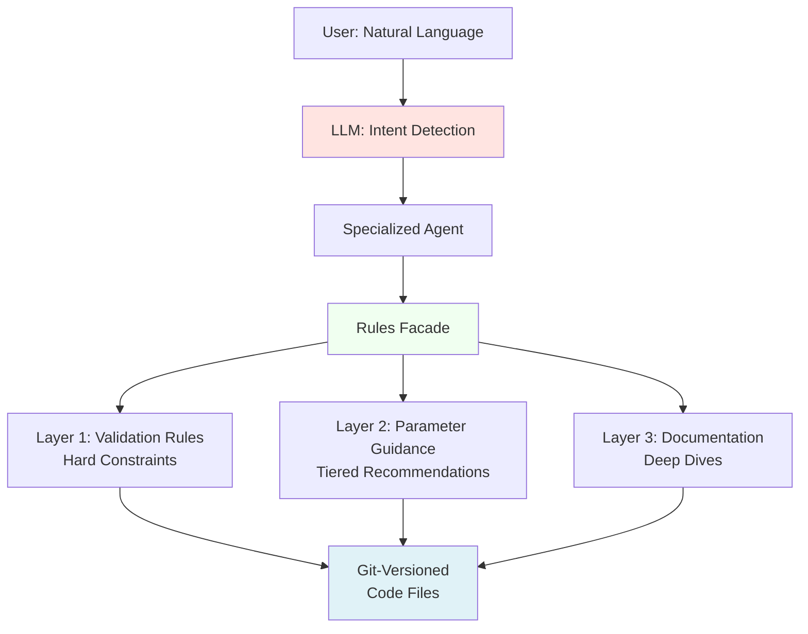

# Intent-Response Governance Framework

**A Generic Pattern for AI Agent Constraint Management**

---

## Executive Summary

The Intent-Response Governance Framework is a **code-based governance pattern** that enables AI agents to make intelligent, rule-compliant recommendations without sacrificing flexibility. It combines:

- **LLM for Intent Detection** - Natural language understanding
- **Documented Policy for Rules** - Git-versioned constraints and guidance
- **Facade for Performance** - Memory-cached rule access

**Key Insight**: Let the LLM handle conversation, but ground it in documented policy for constraints.

---

## The Problem

When building AI agent systems, you face a tension:

- **Too Flexible**: Pure LLM agents hallucinate rules, provide inconsistent advice, violate constraints
- **Too Rigid**: Hardcoded rules are inflexible, hard to maintain, can't adapt to context

**This framework solves both problems.**

---

## The Pattern

### Three-Layer Architecture



**Layer 1: Validation Rules** (What's INVALID)
- Hard constraints that must never be violated
- Example: `stop_loss > 0.1%`, `take_profit > stop_loss`
- Priority levels: CRITICAL (reject), WARNING (allow with log)
- Machine-readable format (JSON/Python dict)

**Layer 2: Parameter Guidance** (What's RECOMMENDED)
- Tiered recommendations for grey areas
- Example: Stop loss 1.5% (conservative), 3% (moderate), 5% (aggressive)
- Context-aware suggestions based on user profile
- Decision trees for complex choices

**Layer 3: Documentation** (Where to LEARN MORE)
- Links to detailed guides and best practices
- Real-world examples with calculations
- Research citations and industry standards
- Related concepts and tools

---

## Core Components

### 1. Intent-Response Mapping (LLM Layer)

**Purpose**: Natural language interface for users

**Pattern**: Orchestrator detects intent → Routes to specialized agent

```python
# Orchestrator (general agent)
def detect_intent(user_message: str) -> str:
    """Map natural language to agent intent."""
    keywords = {
        'strategy': ['create', 'build', 'strategy', 'template'],
        'risk': ['risk', 'stop loss', 'position size'],
        'optimization': ['optimize', 'improve', 'benchmark'],
        'analysis': ['analyze', 'evaluate', 'grade']
    }
    
    for intent, terms in keywords.items():
        if any(term in user_message.lower() for term in terms):
            return intent
    
    return 'general'

# Route to specialized agent
if intent == 'strategy':
    response = strategy_advisor.handle(message)
elif intent == 'risk':
    response = risk_manager.handle(message)
```

**Key Benefits**:
- Natural conversation flow
- Easy to extend (add new intents)
- LLM handles language understanding
- No hardcoded decision trees

---

### 2. Rules Facade (Policy Layer)

**Purpose**: Single access point for all governance rules

**Pattern**: Memory-cached facade over git-versioned rule files

```python
class RulesFacade:
    """
    Facade for accessing governance rules.
    
    Why Facade?
    - Performance: Memory cache (1ms) vs HTTP calls (50-200ms)
    - Simplicity: Single integration point
    - Testability: Easy to mock
    - Maintainability: Change internals without touching agents
    """
    
    def __init__(self):
        self.validation_cache = {}
        self.guidance_cache = {}
        self.documentation_cache = {}
        self.refresh_rules()  # Load at startup
    
    def get_validation_rules(self, parameter: str) -> Dict:
        """Get hard constraints for a parameter."""
        if parameter not in self.validation_cache:
            self.refresh_rules()
        return self.validation_cache.get(parameter, {})
    
    def get_guidance(self, parameter: str, tier: str) -> Dict:
        """Get tiered recommendations."""
        guidance = self.guidance_cache.get(parameter, {})
        return guidance.get('tiers', {}).get(tier, {})
    
    def get_documentation(self, parameter: str) -> Dict:
        """Get documentation references."""
        return self.documentation_cache.get(parameter, {})
    
    def refresh_rules(self):
        """Reload rules from source (git-versioned files)."""
        from .validation_rules import VALIDATION_RULES
        from .parameter_guidance import PARAMETER_GUIDANCE
        from .documentation_index import DOCUMENTATION_INDEX
        
        self.validation_cache = VALIDATION_RULES
        self.guidance_cache = PARAMETER_GUIDANCE
        self.documentation_cache = DOCUMENTATION_INDEX
```

---

### 3. Git-Versioned Rules (Storage Layer)

**Purpose**: Single source of truth for all constraints

**Pattern**: Python/JSON files in version control

**File Structure**:
```
project/
├── rules/
│   ├── validation_rules.py      # Layer 1: Hard constraints
│   ├── parameter_guidance.py    # Layer 2: Recommendations
│   └── documentation_index.py   # Layer 3: References
```

**Example: validation_rules.py**
```python
VALIDATION_RULES = {
    "stop_loss_pct": {
        "type": "float",
        "min": 0.1,
        "max": 50.0,
        "recommended_max": 10.0,  # HTML form limit
        "business_rules": ["BR001"],
        "priority": "CRITICAL"
    },
    "take_profit_pct": {
        "type": "float",
        "min": 0.1,
        "max": 100.0,
        "recommended_max": 20.0,
        "business_rules": ["BR001", "BR002"],
        "priority": "CRITICAL"
    }
}

BUSINESS_RULES = {
    "BR001": {
        "id": "BR001",
        "description": "Take profit must be greater than stop loss",
        "priority": "CRITICAL",
        "condition": "take_profit_pct > stop_loss_pct",
        "error_message": "Take profit ({take_profit}%) must be greater than stop loss ({stop_loss}%)"
    }
}
```

**Example: parameter_guidance.py**
```python
PARAMETER_GUIDANCE = {
    "stop_loss_pct": {
        "display_name": "Stop Loss Percentage",
        "category": "risk_management",
        "tiers": {
            "conservative": {
                "range": [1.0, 2.0],
                "recommended": 1.5,
                "description": "Tight stop loss for capital preservation",
                "suitable_for": ["Beginners", "Small accounts", "Volatile markets"],
                "rationale": "Minimizes individual trade losses while allowing room for normal price fluctuation"
            },
            "moderate": {
                "range": [2.0, 5.0],
                "recommended": 3.0,
                "description": "Balanced risk management for most traders",
                "suitable_for": ["Day traders", "Medium accounts", "Standard strategies"],
                "rationale": "Accommodates intraday volatility while maintaining risk discipline"
            },
            "aggressive": {
                "range": [5.0, 10.0],
                "recommended": 7.0,
                "description": "Wider stops for longer-term holds",
                "suitable_for": ["Swing traders", "Large accounts", "Low volatility stocks"],
                "rationale": "Prevents premature stop-outs in position trades"
            }
        },
        "decision_tree": {
            "questions": [
                {
                    "question": "What is your primary trading style?",
                    "answers": {
                        "Scalper": {"tier": "conservative", "adjustment": -0.5},
                        "Day trader": {"tier": "moderate", "adjustment": 0},
                        "Swing trader": {"tier": "aggressive", "adjustment": 0},
                        "Position trader": {"tier": "aggressive", "adjustment": +2.0}
                    }
                },
                {
                    "question": "What is your account size?",
                    "answers": {
                        "Small (<$10k)": {"tier": "conservative", "adjustment": 0},
                        "Medium ($10k-$50k)": {"tier": "moderate", "adjustment": 0},
                        "Large (>$50k)": {"tier": "aggressive", "adjustment": 0}
                    }
                }
            ]
        }
    }
}
```

---

## Agent Integration Pattern

### Specialized Agent Implementation

```python
class RiskManagerAgent:
    """Specialized agent for risk management advice."""
    
    def __init__(self, rules_facade: RulesFacade):
        self.rules = rules_facade
    
    def handle(self, message: str, context: Dict) -> str:
        """Handle risk management queries."""
        
        # Step 1: Extract intent from message
        if 'stop loss' in message.lower():
            parameter = 'stop_loss_pct'
        elif 'take profit' in message.lower():
            parameter = 'take_profit_pct'
        else:
            return "I can help with stop loss and take profit recommendations."
        
        # Step 2: Get validation rules (hard constraints)
        validation = self.rules.get_validation_rules(parameter)
        
        # Step 3: Get guidance for user's risk profile
        risk_profile = context.get('risk_tolerance', 'moderate')
        guidance = self.rules.get_guidance(parameter, risk_profile)
        
        # Step 4: Get documentation references
        docs = self.rules.get_documentation(parameter)
        
        # Step 5: Compose informed response
        response = f"""
**{guidance['description']}**

**Recommended Value**: {guidance['recommended']}%
**Valid Range**: {validation['min']}% - {validation['max']}%
**Your Range**: {guidance['range'][0]}% - {guidance['range'][1]}%

**Why This Recommendation**:
{guidance['rationale']}

**Suitable For**: {', '.join(guidance['suitable_for'])}

**Learn More**: {docs['overview']}
"""
        return response
```

---

## Benefits of This Pattern

### 1. Separation of Concerns

- **LLM**: Natural language understanding (what the user wants)
- **Documented Rules**: Business logic (what's allowed/recommended)
- **Facade**: Performance optimization (how to access efficiently)

### 2. Maintainability

- ✅ Rules in git (version controlled, reviewable)
- ✅ Change rules without retraining models
- ✅ PR process ensures quality
- ✅ Easy to test (mock the facade)

### 3. Performance

- ✅ Memory cache: 1ms queries
- ✅ No HTTP overhead
- ✅ Batch loading at startup
- ✅ Optional TTL for dynamic rules

### 4. Flexibility

- ✅ LLM handles conversation naturally
- ✅ Context-aware recommendations
- ✅ Tiered guidance for different user profiles
- ✅ Easy to extend (add new rules/tiers)

### 5. Consistency

- ✅ All agents reference same rules
- ✅ No rule duplication or drift
- ✅ Single source of truth
- ✅ Guaranteed consistency across agents

---

## Implementation Checklist

### Phase 1: Validation Rules (Hard Constraints)

- [ ] Define validation rules for critical parameters
- [ ] Create business rules with priorities (CRITICAL/WARNING)
- [ ] Implement validation logic in API/service layer
- [ ] Add validation endpoint for agent access

### Phase 2: Parameter Guidance (Recommendations)

- [ ] Define risk tolerance tiers (conservative/moderate/aggressive)
- [ ] Create tiered recommendations for grey areas
- [ ] Add decision trees for complex parameter selection
- [ ] Include rationale and research citations

### Phase 3: Documentation Index (Deep Dives)

- [ ] Create detailed guides for each parameter
- [ ] Add real-world examples with calculations
- [ ] Include common pitfalls and solutions
- [ ] Link related concepts and tools

### Phase 4: Rules Facade

- [ ] Implement facade class with memory cache
- [ ] Add TTL-based refresh mechanism
- [ ] Create unit tests for all methods
- [ ] Document API for agent integration

### Phase 5: Agent Integration

- [ ] Add facade instance to each agent
- [ ] Update agents to query rules before recommendations
- [ ] Add context-aware suggestion methods
- [ ] Test end-to-end workflows

---

## Real-World Example: Trading Strategy Agent

### User Query
```
User: "Help me configure a day trading strategy"
```

### Agent Workflow

**Step 1: Intent Detection (LLM)**
```python
intent = orchestrator.detect_intent(message)
# Returns: 'strategy_configuration'
```

**Step 2: Route to Specialized Agent**
```python
agent = strategy_advisor
context = {'trading_style': 'day_trader', 'risk_tolerance': 'moderate'}
```

**Step 3: Query Rules Facade**
```python
# Get validation constraints
stop_loss_rules = facade.get_validation_rules('stop_loss_pct')
# min: 0.1%, max: 50.0%, recommended_max: 10.0%

# Get guidance for moderate risk profile
stop_loss_guidance = facade.get_guidance('stop_loss_pct', 'moderate')
# recommended: 3.0%, range: [2.0, 5.0]

# Get documentation
docs = facade.get_documentation('stop_loss_pct')
# overview: /docs/guidance/stop_loss_selection.md
```

**Step 4: Compose Response**
```python
response = f"""
For day trading with moderate risk, I recommend:

**Stop Loss**: {stop_loss_guidance['recommended']}%
- Valid range: {stop_loss_rules['min']}% - {stop_loss_rules['max']}%
- Your recommended range: {stop_loss_guidance['range'][0]}% - {stop_loss_guidance['range'][1]}%
- Rationale: {stop_loss_guidance['rationale']}

This 3% stop loss:
✅ Accommodates intraday volatility
✅ Limits losses to manageable levels
✅ Aligns with industry standards for day trading

Learn more: {docs['overview']}
"""
```

**Step 5: User Sees**
```
Agent: "For day trading with moderate risk, I recommend:

**Stop Loss**: 3.0%
- Valid range: 0.1% - 50.0%
- Your recommended range: 2.0% - 5.0%
- Rationale: Accommodates intraday volatility while maintaining risk discipline

This 3% stop loss:
✅ Accommodates intraday volatility
✅ Limits losses to manageable levels
✅ Aligns with industry standards for day trading

Learn more: /docs/guidance/stop_loss_selection.md"
```

---

## Anti-Patterns to Avoid

### ❌ Don't: Hardcode Rules in Agent Code

```python
# BAD
class RiskManagerAgent:
    def get_stop_loss_recommendation(self):
        return 3.0  # Hardcoded, no flexibility
```

**Why Bad**: No context awareness, hard to change, duplicated across agents

### ✅ Do: Query Rules Facade

```python
# GOOD
class RiskManagerAgent:
    def get_stop_loss_recommendation(self, context):
        risk_profile = context.get('risk_tolerance', 'moderate')
        guidance = self.rules.get_guidance('stop_loss_pct', risk_profile)
        return guidance['recommended']
```

### ❌ Don't: Make HTTP Calls to Rules API from Every Agent

```python
# BAD
class RiskManagerAgent:
    def get_rules(self):
        response = requests.get('/api/validation-rules')
        return response.json()  # Slow, complex, hard to test
```

**Why Bad**: HTTP overhead (50-200ms), complex error handling, hard to mock

### ✅ Do: Use Memory-Cached Facade

```python
# GOOD
class RiskManagerAgent:
    def __init__(self, rules_facade):
        self.rules = rules_facade  # 1ms queries, easy to mock
```

### ❌ Don't: Let LLM Hallucinate Rules

```python
# BAD
prompt = "You are a risk manager. Recommend stop loss percentages."
response = llm.generate(prompt)
# LLM might hallucinate invalid ranges or inconsistent advice
```

**Why Bad**: Inconsistent, unpredictable, violates constraints

### ✅ Do: Ground LLM with Rules

```python
# GOOD
validation = self.rules.get_validation_rules('stop_loss_pct')
guidance = self.rules.get_guidance('stop_loss_pct', 'moderate')

prompt = f"""You are a risk manager. Recommend stop loss.

CONSTRAINTS (MUST FOLLOW):
- Min: {validation['min']}%, Max: {validation['max']}%

GUIDANCE (RECOMMENDED):
- Conservative: {guidance['conservative']['range']}
- Moderate: {guidance['moderate']['range']}
- Aggressive: {guidance['aggressive']['range']}

User context: {context}
"""
response = llm.generate(prompt)
```

---

## Extending the Framework

### Adding New Rules

**Step 1**: Add to validation_rules.py
```python
"new_parameter": {
    "type": "integer",
    "min": 1,
    "max": 100,
    "recommended_max": 50,
    "business_rules": ["BR010"],
    "priority": "CRITICAL"
}
```

**Step 2**: Add to parameter_guidance.py
```python
"new_parameter": {
    "tiers": {
        "conservative": {"range": [1, 10], "recommended": 5},
        "moderate": {"range": [10, 30], "recommended": 20},
        "aggressive": {"range": [30, 50], "recommended": 40}
    }
}
```

**Step 3**: Add to documentation_index.py
```python
"new_parameter": {
    "overview": "/docs/new_parameter_guide.md",
    "examples": "/docs/examples/new_parameter_examples.md"
}
```

**Step 4**: Agents automatically get access (no code changes needed!)

---

## Testing Strategy

### Unit Tests: Rules Facade
```python
def test_get_validation_rules():
    facade = RulesFacade()
    rules = facade.get_validation_rules('stop_loss_pct')
    assert rules['min'] == 0.1
    assert rules['max'] == 50.0

def test_get_guidance():
    facade = RulesFacade()
    guidance = facade.get_guidance('stop_loss_pct', 'moderate')
    assert guidance['recommended'] == 3.0
    assert guidance['range'] == [2.0, 5.0]
```

### Integration Tests: Agent Behavior
```python
def test_agent_follows_constraints():
    facade = RulesFacade()
    agent = RiskManagerAgent(facade)
    
    context = {'risk_tolerance': 'moderate'}
    recommendation = agent.handle("recommend stop loss", context)
    
    # Verify agent respects constraints
    stop_loss = extract_stop_loss(recommendation)
    assert 0.1 <= stop_loss <= 50.0  # Within valid range
    assert 2.0 <= stop_loss <= 5.0   # Within moderate tier range
```

---

## Migration Path (Existing Projects)

### Starting from Scratch? (Greenfield)
1. Implement Phase 1 (Validation Rules)
2. Add Phase 2 (Parameter Guidance)
3. Implement Facade
4. Integrate with agents

### Have Existing Hardcoded Rules? (Brownfield)
1. **Extract**: Identify all hardcoded constraints in agent code
2. **Migrate**: Move to validation_rules.py
3. **Refactor**: Update agents to use facade
4. **Test**: Verify behavior unchanged
5. **Extend**: Add Phase 2 & 3 features

### Have Existing API Endpoint?
1. **Keep API**: For external consumers
2. **Add Facade**: For internal agents (performance)
3. **Dual Path**: Both access same source files
4. **Gradual Migration**: Move agents one by one

---

## Conclusion

The Intent-Response Governance Framework solves the AI agent constraint problem by:

✅ **LLM for Intent** - Natural conversation, no hardcoded trees
✅ **Documented Policy for Rules** - Git-versioned, reviewable, testable
✅ **Facade for Performance** - Memory-cached, 50-200x faster than HTTP
✅ **Three-Layer System** - Validation + Guidance + Documentation

**Key Takeaway**: Let the LLM handle conversation, but ground it in documented policy for constraints.

---

## Further Reading

- **Agent Governance Portal**: In-app documentation browser
- **Risk Classification Framework**: Risk-based approval workflows
- **Business Rules Reference**: Complete constraint documentation
- **Parameter Guidance**: Tiered recommendations and decision trees

---

**Version**: 1.0  
**License**: MIT  
**Maintained By**: Your Organization
